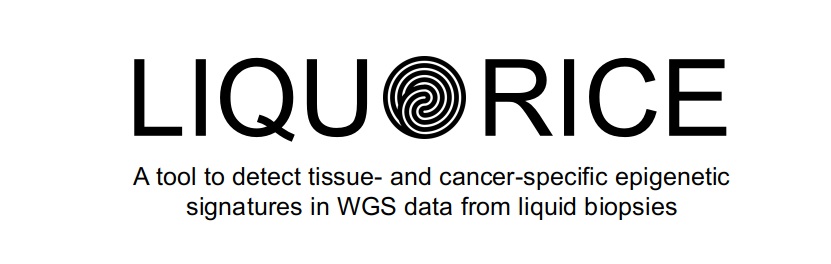

.. LIQUORICE documentation master file, created by
   sphinx-quickstart on Tue Jan 19 11:40:10 2021.
   You can adapt this file completely to your liking, but it should at least
   contain the root `toctree` directive.

LIQUORICE: Detect epigenetic signatures in cell-free DNA from liquid biopsies
==========================================================================

Welcome to  ``LIQUORICE``'s documentation! You can navigate through the menu on the left to learn more about the tool. A very condensed overview follows below:

Quickstart
==========

``LIQUORICE`` is a command-line-tool and python package for bias correction and quantification of changes in sequencing coverage around regions of interest in cfDNA WGS datasets. 
``LIQUORICE`` can be used to detect and quantify tissue or cancer-specific epigenetic signatures in liquid biopsies. 
The tool takes four different files as input:
 - a FASTA file of the reference genome
 - an indexed BAM file containing the aligned paired-end whole-genome sequencing reads of a liquid biopsy sample
 - a BIGWIG mappability file, available for download for hg19 and hg38 `here <https://doi.org/10.5281/zenodo.5521424>`_
 - one or more BED files representing a set of regions of interest (such as DNase I hypersensitivity sites or enhancer regions specific for a tissue or tumor). Read more :ref:`here <region_sets_anchor>`.

You can install ``LIQUORICE`` like so (:ref:`details <installation_anchor>`):

.. code-block:: bash

    # to install on Linux
    conda create -n LIQUORICE -c bioconda -c conda-forge liquorice ray-core

    # to activate the environment
    conda activate LIQUORICE # or: 'source activate LIQUORICE' for older conda versions

You can test ``LIQUORICE`` on a small test dataset we provide by following the example below. Please note that the .bam and .bw file used in this example should only be used for testing purposes. 
They have been processed to keep the file size small.

.. code-block:: bash

    # Set desired nr. of cpus
    N_CPUS=5

    # download and unzip the reference genome and reference mappability file
    wget https://hgdownload.soe.ucsc.edu/goldenPath/hg38/bigZips/p12/hg38.p12.fa.gz
    gunzip hg38.p12.fa.gz
    wget https://github.com/epigen/LIQUORICE/raw/master/liquorice/data/hg38.p12.fa.fai
    wget https://github.com/epigen/LIQUORICE/raw/master/liquorice/data/hg38.fa.mappability_100bp.subsetted_for_testdata.bw

    # download .bam file of a healthy control liquid biopsy sample (pre-processed to keep the size small)
    wget https://github.com/epigen/LIQUORICE/raw/master/liquorice/data/Ctrl_17_testdata.bam
    wget https://github.com/epigen/LIQUORICE/raw/master/liquorice/data/Ctrl_17_testdata.bam.bai

    # download .bed file for universally accessible DHSs
    wget https://github.com/epigen/LIQUORICE/raw/master/liquorice/data/universal_DHSs.bed

    # run LIQUORICE
    LIQUORICE --bamfile Ctrl_17_testdata.bam --refgenome_fasta "hg38.p12.fa" \
            --mappability_bigwig "hg38.fa.mappability_100bp.subsetted_for_testdata.bw" \
            --bedpathlist "universal_DHSs.bed" \
            --blacklist "hg38" --n_cpus "${N_CPUS}" --extend_to 15000

.. toctree::
    :maxdepth: 3
    :caption: Contents:

    intro
    liquorice
    liquorice_commandline_tool

Indices and tables
==================

* :ref:`genindex`
* :ref:`modindex`
* :ref:`search`
