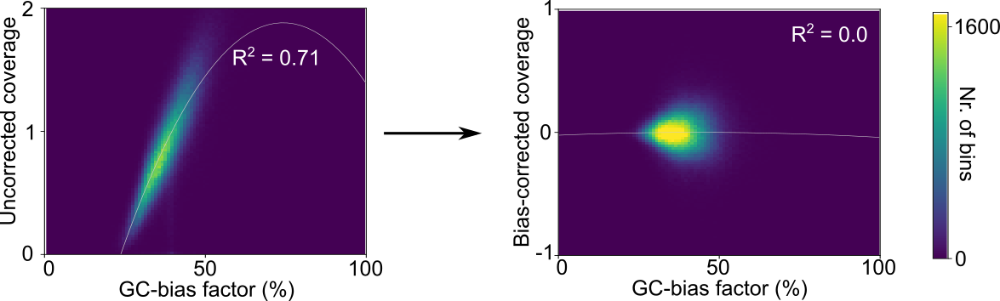
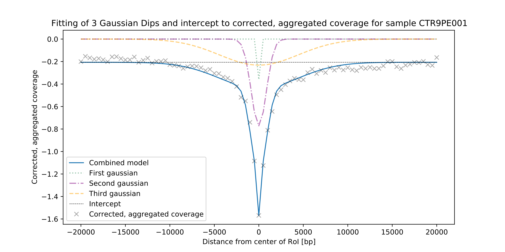
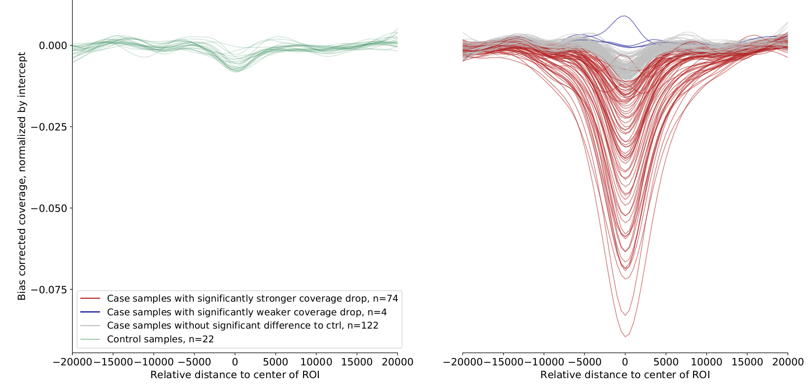
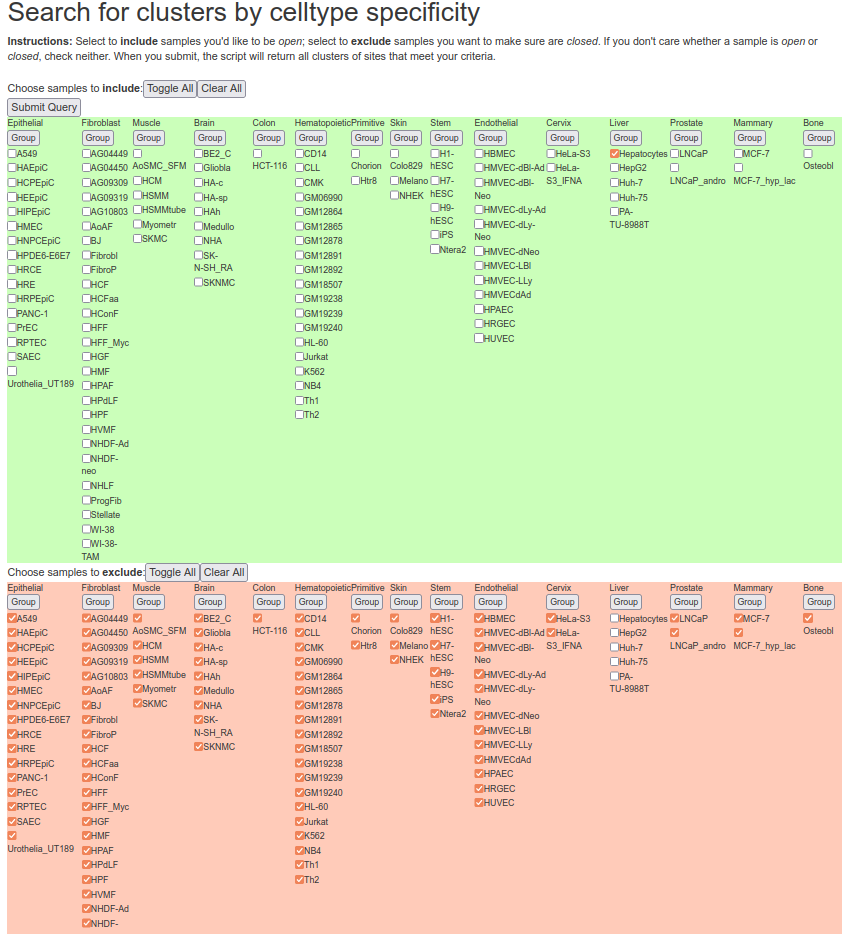
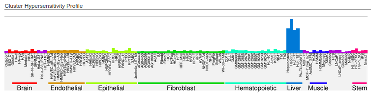
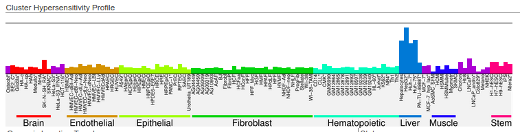

.. image:: ../img/liquorice_logo_fitted.png
  :width: 650
  :alt: LIQUORICE logo

Introduction
============

``LIQUORICE`` is a command-line-tool and python package for bias correction and quantification of changes
in sequencing coverage around regions of interest in cfDNA WGS datasets. ``LIQUORICE`` can be used to detect and quantify
tissue or cancer-specific epigenetic signatures in liquid biopsies. This allows accurate quantification of the
fraction of tumor-derived cell-free DNA, `as demonstrated in our recent publication <https://doi.org/10.1038/s41467-021-23445-w>`_.

Motivation
**********

The fragmentation of cell-free DNA (cfDNA) obtained from liquid biopsies is non-random, and contains information about
the
epigenetic state of its cell-of-origin. DNA in nucleosomes is protected from cleavage, resulting in an increase in
sequencing coverage in genomic regions that are occupied by nucleosomes. If a set of genomic regions is
specifically accessible in a cell-, tissue- or cancer type of interest, an observed decrease in sequencing coverage
around these regions can indicate that cells of this type are present in the organism, and are releasing cfDNA
into the bloodstream.

Potential application areas
***************************

``LIQUORICE`` could be useful for a variety of cfDNA-related analysis tasks:

- Cancer detection, classification, monitoring and survival prognosis (`as demonstrated in our recent publication <https://doi.org/10.1038/s41467-021-23445-w>`_)
- Classification of cancers of unknown primary
- Location of metastasis
- Tissue damage monitoring for transplantations, heart attack, and other diseases

What ``LIQUORICE`` does
***********************

``LIQUORICE`` addresses two problems regarding the quantification of epigenetic signatures from a sequencing coverage signal:

-  Coverage is influenced by bias-factors, such as GC-content, mappability and other factors related to sequence composition
-  The coverage signal needs to be summarized over all regions in a region-set, and needs to be quantified as a number that is robust and comparable between samples

In a first step, ``LIQUORICE`` trains a bias-model, which learns the association between bias-factors and coverage. Then,
the trained model is used to correct the coverage signal in the regions of interest. Finally, the signal is
aggregated between regions and quantified by fitting a model to the data. ``LIQUORICE`` produces tables as well as plots
that allow for the visual inspection of biases and of the coverage signal. Furthermore, a summary tool is included,
which allows for the convenient comparison of signals between samples and region-sets.

Here are a few examples of ``LIQUORICE``'s output:

.. _region_sets_anchor:

Region-sets
***********

In the context of ``LIQUORICE``, we refer to a region-set as a set of genomic regions with similar properties. This
could be, e.g., enhancers or DNase I hypersensitivity sites that are specific for a cell-type, cancer-type, or tissue.
Useful ressources to obtain such region-sets include `http://dnase.genome.duke.edu/ <http://dnase.genome.duke
.edu/>`_ and `ENCODE <https://www.encodeproject.org/>`_.

Here is an example on how we obtained liver-specific DNase I hypersensitivity sites from the `http://dnase.genome.duke.edu/celltype.php <http://dnase.genome.duke.edu/celltype.php>`_ interface. First, we required all non-liver cells to be "closed", and we required hepatocytes to be "open" at a given DHS:

Then, we selected two clusters that have an adequate tissue-specific accessibility pattern:

http://dnase.genome.duke.edu/clusterDetail.php?clusterID=1066

and http://dnase.genome.duke.edu/clusterDetail.php?clusterID=1115 ​

We downloaded the .bed files (with all regions) from these clusters, and finally, we concatenated the downloaded files,
merging the DHSs of these two clusters in order to get our final liver-specific DHS set. Note that the regions on the
database are stored in hg19 coordinates - you can use `LiftOver <https://genome.ucsc.edu/goldenPath/help/hgTracksHelp.html#Liftover>`_ to convert the data to hg38.

How to use ``LIQUORICE``
************************

The easiest way to use ``LIQUORICE`` is via its :ref:`command-line interface <LIQUORICE_command_line_tool>`. Also
check out the convenient :ref:`summary tool <LIQUORICE_summary_tool>` if you are analyzing multiple samples or
region-sets.

If you require more control about the steps performed by LIQUORICE, check out the
:ref:`LIQUORICE python package <LIQUORICE_python_package>` - you can start by looking at the function-level documentation and source code of the :ref:`liquorice.LIQUORICE module <liquorice_LIQUORICE_anchor>` as well as the the :ref:`liquorice.utils.Workflows module <workflows_anchor>`.

More details on parameters, test examples and usage examples can be found :ref:`here <usage_parameters_and_examples>`

Contact
*******
If you have any questions about ``LIQUORICE`` and how to apply it to your data, create an issue on `github <https://github.com/epigen/liquorice>`_ or contact peter.peneder@ccri.at - we are happy to hear from you.

Source code on Github
*********************
The github repository of ``LIQUORICE`` can be found at `https://github.com/epigen/liquorice <https://github.com/epigen/liquorice>`_.

Installation
============

.. _installation_anchor:

conda
*****

``LIQUORICE`` can easily be installed via `conda <https://docs.conda.io/en/latest/>`_. We recommend installing
LIQUORICE in its own conda environment to keep dependencies clean:

.. code-block:: bash

    # to install on Linux
    conda create -n LIQUORICE -c bioconda -c conda-forge liquorice ray-core

    # to install on macOS
    # conda create -n LIQUORICE -c bioconda -c conda-forge liquorice

    # to activate the environment
    conda activate LIQUORICE # or: 'source activate LIQUORICE' for older conda versions

    # to run
    LIQUORICE <flags and arguments>

'ray-core' is an optional dependency of LIQUORICE that helps it run faster on multiple cores. It is not possible to
install it via conda on macOS, so installing it can either be skipped (find details about an alternative parallelization
approach :ref:`here <parallelization>`) or it can be installed as described `here <https://docs.ray.io/en/latest/installation.html>`_
(e.g. `pip install -U ray==1.1.0`). LIQUORICE has been tested for ray version 1.1.0.

docker
******

You can also use the ``LIQUORICE`` docker image which is available `here <https://hub.docker.com/r/peneder/liquorice>`_.
To pull, use

.. code-block:: bash

  docker pull peneder/liquorice

Citation
========

If you use ``LIQUORICE`` in any published work, please cite:

`Peneder, P., Stütz, A. M., Surdez, D., Krumbholz, M., Semper, S., Chicard, M., ... & Tomazou, E. M. (2021). Multimodal analysis of cell-free DNA whole-genome sequencing for pediatric cancers with low mutational burden. Nature communications, 12(1), 1-16.`
